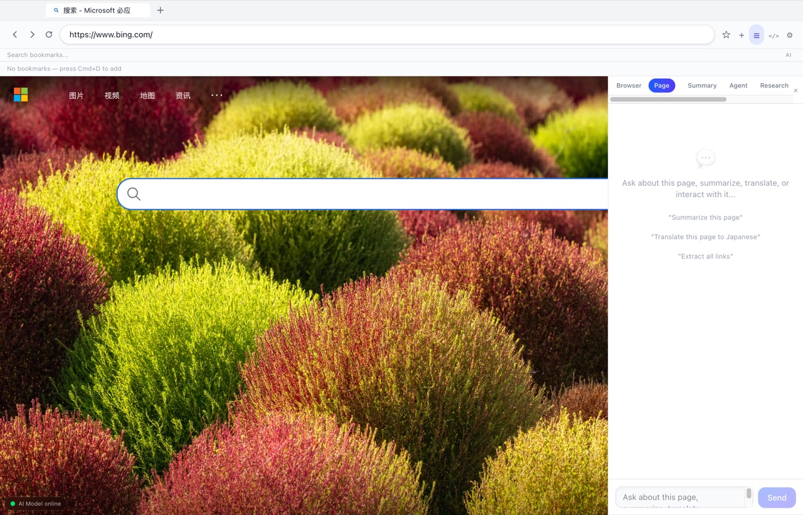
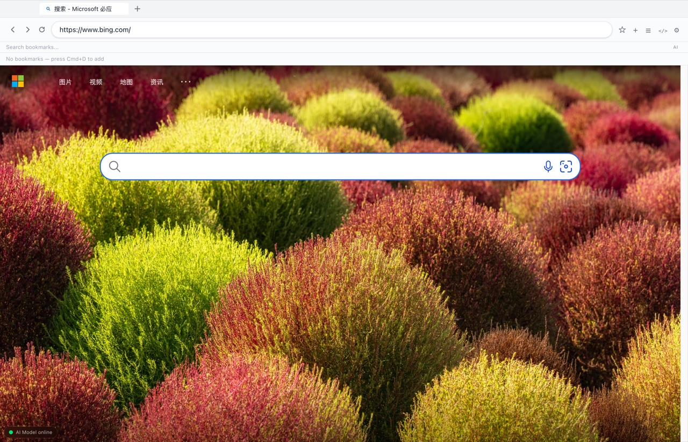

# WiseWander

AI-native browser built on Electron + Ollama. Local models first, cloud fallback, AI capabilities (dual assistants, summarize, translate, automation agents, deep research, web crawler, full-page screenshots, page monitoring, accessibility audits) as first-class browser features — with all data kept local.

| New tab (light) | New tab (dark) | AI sidebar |
|---|---|---|
|  |  |  |

> Interactive architecture diagrams (theme switching / relationship tracing / export):
> - [System architecture](docs/diagrams/wisewander-architecture.html)
> - [AI chat data flow](docs/diagrams/wisewander-chat-dataflow.html)
> - [Agent execution sequence](docs/diagrams/wisewander-agent-sequence.html)

## Tech Stack

- **Framework**: Electron 33 / electron-vite (ESM)
- **Frontend**: React 19 + TypeScript + Tailwind CSS 4 + Zustand 5
- **Local AI**: Ollama (first), optional OpenAI / Anthropic / OpenAI-compatible endpoints as fallback
- **Storage**: better-sqlite3 (WAL) + electron-store
- **Testing**: Vitest (unit / integration) + Playwright (E2E) + ESLint 9

## Features

- **Browser core**: multi-tab (drag reorder / restore), address bar, bookmarks (with nomic-embed-text semantic search), history, download manager (real progress + persisted records), workspaces
- **AI sidebar**: browser assistant (can execute browser tools) / per-tab page chat / summaries (three lengths) / translate / Stop button truly aborts (AbortSignal all the way down to the HTTP request)
- **Agent automation**: natural language → JSON step planning → 7 tools (navigate/click/type/extract/scroll/wait/ai_process) driving the page, with real cancellation
- **AI capability suite**: web crawler, full-page screenshot (scroll & stitch), data extraction, multi-tab analysis, CSS smart editor, accessibility audit, markdown export, page monitoring (AI change summaries)
- **Research & recommendations**: research reports / research workbench / interest-profile recommendations / reading queue (AI summaries)
- **Privacy**: ad & tracker blocking (per-category stats), fingerprint protection, privacy mode (forces local-only AI)
- **DevTools**: Console / Network / Elements / Storage / AI debug panel

## Development

```bash
npm install
npm run dev
```

## Build

```bash
npm run build
```

## Testing

```bash
npm run test:unit        # Unit tests
npm run test:integration # Integration tests
npm run test:e2e         # E2E tests (build first; requires a local Ollama)
npm run typecheck        # Type check (both node + web tsconfigs)
npm run lint             # ESLint
```

## Documentation

- [Product Requirements (PRD)](docs/PRD.md)
- [Technical Design (DESIGN)](docs/DESIGN.md)
- [Test Strategy (TEST)](docs/TEST.md)
- [CLAUDE.md](CLAUDE.md) — codebase guide (architecture, conventions, gotchas)
