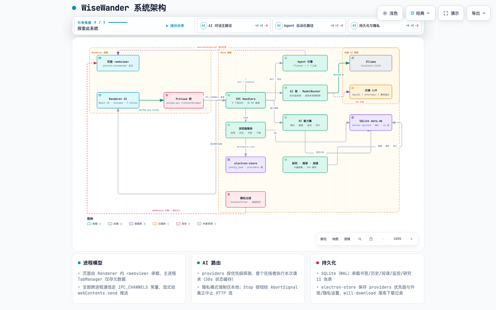

# WiseWander — 技术设计文档

> 版本: 1.1.0
> 更新日期: 2026-09-15
> 状态: Active（与代码同步修订）

> **架构图（archify 生成，交互式，浏览器打开）**
>
> | 图 | 说明 |
> |----|------|
> | [系统架构](diagrams/wisewander-architecture.html) | 三进程模型、IPC 通道、服务与存储落点 |
> | [AI 对话数据流](diagrams/wisewander-chat-dataflow.html) | 从发送到流式渲染的主路径 + Stop 真中止路径 |
> | [Agent 执行时序](diagrams/wisewander-agent-sequence.html) | 规划 → 逐步执行 → 进度回推 → 取消 |
>
> 静态预览（1440×900）：`docs/diagrams/*.visual-check.*.png`

---

## 1. 技术栈

| 层级 | 技术 | 版本 | 用途 |
|------|------|------|------|
| 框架 | Electron | 33+ | 桌面应用壳 |
| 渲染引擎 | Chromium | (随 Electron) | 网页渲染 |
| 前端框架 | React | 19+ | UI 组件 |
| 语言 | TypeScript | 5.7+ | 类型安全 |
| 构建工具 | Vite + electron-vite | 最新 | 开发与打包 |
| 状态管理 | Zustand | 5+ | 轻量状态管理 |
| 样式 | Tailwind CSS | 4+ | 原子化 CSS |
| AI 运行时 | Ollama | 最新 | 本地 LLM 推理 |
| 数据存储 | better-sqlite3 | 最新 | 结构化数据 |
| 键值存储 | electron-store | 最新 | 配置与偏好 |
| 测试 | Vitest + Playwright | 最新 | 测试框架 |

---

## 2. 系统架构

### 2.1 架构总览



> 交互版：[wisewander-architecture.html](diagrams/wisewander-architecture.html)（支持主题切换、关系追踪、按视图聚焦）

要点：

- **页面容器是 Renderer 内的 `<webview>` 标签**（`webviewTag: true`，`partition="persist:wisewander"`）；主进程 `TabManager` 仅维护元数据与已关闭标签栈
- 全部跨进程通信走 `shared/ipc-channels.ts` 的通道常量；流式数据（聊天、Agent 步骤、爬虫/截图进度、下载进度）经 `webContents.send` 推送
- AI 层的 `ModelRouter` 按 `providers` 优先级逐请求探测，首个在线者执行；隐私模式强制仅本地

### 2.2 进程模型

Electron 采用多进程架构：

- **Main Process**：唯一的 Node.js 进程（ESM），负责窗口管理、原生 API、AI 路由、Agent 执行、SQLite 与内容过滤；页面密集型操作经 `executeJavaScript` 下放到 webview guest
- **Renderer Process**：Chromium 渲染进程，运行 React UI；页面通过 `<webview>` 标签承载（非 WebContentsView），导航/前进/后退由 renderer 直接调 webview 方法
- **Preload Scripts**：安全桥接层，通过 `contextBridge` 暴露 `window.api`（约 90 个通道的 typed 包装 + 流式订阅）

### 2.3 安全边界

```
Renderer Process          Preload              Main Process
     │                      │                      │
     │  window.api.xxx()    │                      │
     ├─────────────────────►│  ipcRenderer.invoke  │
     │                      ├─────────────────────►│
     │                      │                      │ Node.js APIs
     │                      │                      │ Ollama HTTP
     │                      │                      │ SQLite
     │                      │  return result       │
     │   result             │◄─────────────────────┤
     │◄─────────────────────┤                      │
```

关键原则：
- 渲染进程**永远不**直接访问 Node.js API
- 所有跨进程调用通过 Preload 的 `contextBridge` 暴露的 API
- IPC 通道使用白名单验证

---

## 3. 目录结构

```
wisewander/
├── electron.vite.config.ts         # 构建配置
├── package.json
├── tsconfig.json
├── tsconfig.node.json
├── tsconfig.web.json
│
├── src/
│   ├── main/                       # Main Process
│   │   ├── index.ts                # 入口：创建窗口、注册 IPC
│   │   ├── ipc/                    # IPC Handler 注册
│   │   │   ├── index.ts
│   │   │   ├── browser.ipc.ts      # 浏览器相关 IPC
│   │   │   ├── ai.ipc.ts           # AI 相关 IPC
│   │   │   ├── agent.ipc.ts        # Agent 相关 IPC
│   │   │   ├── capability.ipc.ts   # 能力（爬虫/设计分析）IPC
│   │   │   ├── research.ipc.ts     # 研究助手 IPC
│   │   │   └── workspace.ipc.ts    # 工作区 IPC
│   │   │
│   │   ├── services/               # 主进程服务
│   │   │   ├── browser/
│   │   │   │   ├── tab-manager.ts      # 标签生命周期管理
│   │   │   │   ├── bookmark-service.ts # 书签 CRUD
│   │   │   │   ├── history-service.ts  # 历史记录管理
│   │   │   │   ├── download-service.ts # 下载管理
│   │   │   │   └── workspace.ts        # 工作区管理
│   │   │   │
│   │   │   ├── ai/
│   │   │   │   ├── ollama-client.ts    # Ollama API 客户端
│   │   │   │   ├── cloud-client.ts     # 云端 AI 客户端
│   │   │   │   ├── router.ts           # AI 路由（本地/云端）
│   │   │   │   ├── model-manager.ts    # 模型发现与选择
│   │   │   │   ├── prompt-builder.ts   # Prompt 模板构建
│   │   │   │   ├── stream-handler.ts   # 流式响应处理
│   │   │   │   └── context-extractor.ts # 页面上下文提取
│   │   │   │
│   │   │   ├── agent/
│   │   │   │   ├── planner.ts          # 任务分解与规划
│   │   │   │   ├── executor.ts         # 操作执行引擎
│   │   │   │   ├── tool-registry.ts    # Agent Tool 注册表
│   │   │   │   └── tools/              # 内置 Tool 定义
│   │   │   │       ├── index.ts
│   │   │   │       ├── navigate.ts
│   │   │   │       ├── click.ts
│   │   │   │       ├── type.ts
│   │   │   │       ├── extract.ts
│   │   │   │       ├── scroll.ts
│   │   │   │       ├── wait.ts
│   │   │   │       └── ai-process.ts
│   │   │   │
│   │   │   ├── capability/
│   │   │   │   ├── web-crawler.ts      # 网页爬虫
│   │   │   │   └── design-analyzer.ts  # 设计风格分析
│   │   │   │
│   │   │   ├── research/
│   │   │   │   └── research-engine.ts  # 研究助手引擎
│   │   │   │
│   │   │   └── privacy/
│   │   │       ├── content-filter.ts   # 广告/追踪器过滤
│   │   │       ├── tracker-detector.ts # 追踪器检测
│   │   │       └── fingerprint.ts      # 指纹保护
│   │   │
│   │   └── store/                  # 数据存储层
│   │       ├── database.ts             # SQLite 初始化与迁移
│   │       └── config.ts               # electron-store 配置
│   │
│   ├── preload/                    # Preload Scripts
│   │   └── index.ts                # 主窗口 preload + contextBridge
│   │
│   ├── renderer/                   # Renderer Process (React)
│   │   ├── index.html              # HTML 入口
│   │   ├── main.tsx                # React 入口
│   │   ├── App.tsx                 # 根组件
│   │   │
│   │   ├── components/             # UI 组件
│   │   │   ├── browser/
│   │   │   │   ├── TabBar.tsx          # 标签栏
│   │   │   │   ├── AddressBar.tsx      # 地址栏（含导航按钮）
│   │   │   │   ├── BrowserView.tsx     # WebView 容器
│   │   │   │   ├── BookmarkBar.tsx     # 书签栏
│   │   │   │   └── DownloadBar.tsx     # 下载栏
│   │   │   │
│   │   │   ├── ai/
│   │   │   │   ├── AISidebar.tsx       # AI 侧边栏容器
│   │   │   │   ├── ChatPanel.tsx       # 对话面板
│   │   │   │   ├── SummaryPanel.tsx    # 摘要面板
│   │   │   │   ├── TranslatePanel.tsx  # 翻译面板
│   │   │   │   ├── MessageBubble.tsx   # 消息气泡
│   │   │   │   └── StreamingText.tsx   # 流式文本渲染
│   │   │   │
│   │   │   ├── agent/
│   │   │   │   ├── AgentPanel.tsx      # Agent 控制面板
│   │   │   │   ├── TaskList.tsx        # 任务列表
│   │   │   │   └── ExecutionLog.tsx    # 执行日志
│   │   │   │
│   │   │   ├── capability/
│   │   │   │   ├── CapabilityListPanel.tsx  # 能力列表面板
│   │   │   │   ├── DesignAnalyzerPanel.tsx  # 设计分析面板
│   │   │   │   ├── MarkdownExporterPanel.tsx # Markdown 导出
│   │   │   │   ├── TemplatePreview.tsx      # 模板预览
│   │   │   │   └── WebCrawlerPanel.tsx      # 爬虫面板
│   │   │   │
│   │   │   ├── research/
│   │   │   │   ├── ResearchPanel.tsx   # 研究助手面板
│   │   │   │   ├── ReportView.tsx      # 报告视图
│   │   │   │   └── SourceList.tsx      # 来源列表
│   │   │   │
│   │   │   ├── settings/
│   │   │   │   ├── SettingsPage.tsx    # 设置页面
│   │   │   │   ├── ModelConfig.tsx     # 模型配置
│   │   │   │   └── PrivacyConfig.tsx   # 隐私配置
│   │   │   │
│   │   │   ├── devtools/
│   │   │   │   ├── DevToolsPanel.tsx   # 开发者工具面板
│   │   │   │   ├── AIPanel.tsx         # AI 调试面板
│   │   │   │   ├── ConsolePanel.tsx    # 控制台面板
│   │   │   │   ├── ElementsPanel.tsx   # 元素面板
│   │   │   │   ├── NetworkPanel.tsx    # 网络面板
│   │   │   │   └── StoragePanel.tsx    # 存储面板
│   │   │   │
│   │   │   └── common/
│   │   │       ├── CommandPalette.tsx  # 命令面板 (Cmd+K)
│   │   │       ├── Tooltip.tsx
│   │   │       └── Modal.tsx
│   │   │
│   │   ├── hooks/                  # React Hooks
│   │   │   └── useTheme.ts             # 主题切换 Hook
│   │   │
│   │   ├── services/               # 渲染进程服务
│   │   │   ├── page-extractor.ts       # 页面内容提取
│   │   │   ├── readability-extractor.ts # Readability 提取
│   │   │   ├── html-to-markdown.ts     # HTML → Markdown
│   │   │   └── design-style-extractor.ts # 设计风格提取
│   │   │
│   │   ├── store/                  # Zustand 状态管理
│   │   │   ├── tab-store.ts           # 标签状态
│   │   │   ├── ai-store.ts            # AI 对话状态
│   │   │   ├── agent-store.ts         # Agent 状态
│   │   │   ├── capability-store.ts    # 能力状态
│   │   │   ├── settings-store.ts      # 设置状态
│   │   │   └── devtools-store.ts      # 开发者工具状态
│   │   │
│   │   ├── styles/                 # 全局样式
│   │   │   └── globals.css
│   │   │
│   │   └── types/                  # TypeScript 类型
│   │       └── window.d.ts
│   │
│   └── shared/                     # 进程间共享
│       ├── types.ts                # 共享类型定义
│       ├── constants.ts            # 共享常量
│       └── ipc-channels.ts         # IPC 通道名称
│
├── docs/                           # 文档
│   ├── PRD.md
│   ├── DESIGN.md
│   └── TEST.md
│
└── tests/                          # 测试
    ├── unit/
    ├── integration/
    └── e2e/
```

---

## 4. 核心模块设计

### 4.1 Browser Core

#### 4.1.1 标签管理 (TabManager)

```typescript
// src/main/services/browser/tab-manager.ts

interface Tab {
  id: string;
  url: string;
  title: string;
  favicon?: string;
  status: 'loading' | 'loaded' | 'error';
  webContentsId: number;
  groupId?: string;
  lastAccessed: number;
}

class TabManager {
  private tabs: Map<string, Tab>;
  private activeTabId: string | null;

  createTab(url?: string): Tab;
  closeTab(id: string): void;
  activateTab(id: string): void;
  reorderTab(id: string, newIndex: number): void;
  getActiveTab(): Tab | null;
  getAllTabs(): Tab[];
}
```

**实现要点**：
- 每个 Tab 对应一个 `<webview>` 标签（渲染进程中）或 `BrowserView`（主进程中）
- MVP 阶段使用 `<webview>` 标签，更简单可控
- 标签状态通过 IPC 同步到渲染进程

#### 4.1.2 导航控制 (Navigation)

```typescript
// src/main/services/browser/navigation.ts

class Navigation {
  goBack(tabId: string): void;
  goForward(tabId: string): void;
  reload(tabId: string, ignoreCache?: boolean): void;
  loadURL(tabId: string, url: string): void;
  stopLoading(tabId: string): void;
}
```

#### 4.1.3 页面上下文提取 (ContextExtractor)

```typescript
// src/main/services/ai/context-extractor.ts

interface PageContext {
  url: string;
  title: string;
  textContent: string;        // 主要文本内容（去噪后）
  headings: Heading[];        // 标题结构
  links: Link[];              // 链接列表
  images: Image[];            // 图片（含 alt 文本）
  tables: Table[];            // 表格数据
  metadata: Record<string, string>;  // meta 标签信息
  language: string;           // 页面语言
}

class ContextExtractor {
  // 通过注入 JS 到 webview 提取页面内容
  extractFromWebview(webContentsId: number): Promise<PageContext>;
  // 截取页面截图用于多模态
  captureScreenshot(webContentsId: number): Promise<Buffer>;
}
```

---

### 4.2 AI Service Layer

#### 4.2.1 Ollama 客户端

```typescript
// src/main/services/ai/ollama-client.ts

interface OllamaConfig {
  baseUrl: string;            // 默认 http://localhost:11434
  defaultModel: string;       // 默认模型名
  timeout: number;            // 请求超时 ms
}

interface ChatMessage {
  role: 'system' | 'user' | 'assistant';
  content: string;
}

interface StreamChunk {
  done: boolean;
  response: string;
  model: string;
}

class OllamaClient {
  // 健康检查
  async healthCheck(): Promise<{ status: 'ok' | 'error'; models: Model[] }>;
  // 获取可用模型列表
  async listModels(): Promise<Model[]>;
  // 拉取模型
  async pullModel(name: string, onProgress?: (p: number) => void): Promise<void>;
  // 对话（流式）
  async chat(
    model: string,
    messages: ChatMessage[],
    onChunk: (chunk: StreamChunk) => void
  ): Promise<void>;
  // 生成（单次，流式）
  async generate(
    model: string,
    prompt: string,
    system?: string,
    onChunk: (chunk: StreamChunk) => void
  ): Promise<void>;
}
```

**Ollama API 对接**：
- 使用 Ollama REST API (`/api/chat`, `/api/generate`, `/api/tags`)
- 流式响应通过 NDJSON (Newline Delimited JSON) 逐行解析
- 连接失败时自动重试（最多 3 次，指数退避）

#### 4.2.2 Prompt 模板系统

```typescript
// src/main/services/ai/prompt-builder.ts

interface PromptTemplate {
  id: string;
  name: string;
  system: string;
  user: (context: PageContext, userMessage: string) => string;
}

// 内置模板
const TEMPLATES: Record<string, PromptTemplate> = {
  chat: {
    id: 'chat',
    name: '页面对话',
    system: `你是一个智能助手。用户正在浏览一个网页，请基于页面内容回答问题。
规则：
- 回答基于页面内容，不要编造
- 引用原文时标注位置
- 如果页面内容不足以回答，请如实说明`,
    user: (ctx, msg) => `页面标题：${ctx.title}\n页面URL：${ctx.url}\n\n页面内容：\n${ctx.textContent.slice(0, 8000)}\n\n用户问题：${msg}`,
  },
  summary: {
    id: 'summary',
    name: '页面摘要',
    system: `你是一个内容摘要专家。请为以下网页内容生成摘要。`,
    user: (ctx, _msg) => `请为以下内容生成摘要：\n\n${ctx.textContent.slice(0, 12000)}`,
  },
  translate: {
    id: 'translate',
    name: '翻译',
    system: `你是一个专业翻译。请将用户提供的文本翻译为目标语言。仅输出翻译结果，不要添加解释。`,
    user: (ctx, msg) => msg,  // 翻译直接使用用户选中的文本
  },
};
```

#### 4.2.3 流式响应处理

```typescript
// src/main/services/ai/stream-handler.ts

class StreamHandler {
  private buffer: string = '';

  // 处理 Ollama 流式响应的 NDJSON
  handleNDJSON(line: string): { text: string; done: boolean } {
    const chunk = JSON.parse(line);
    this.buffer += chunk.response;
    return { text: this.buffer, done: chunk.done };
  }

  // 通过 IPC 发送流式更新到渲染进程
  async pipeToIPC(
    stream: AsyncIterable<Buffer>,
    channel: string,
    tabId: string
  ): Promise<string> {
    for await (const chunk of stream) {
      const { text, done } = this.handleNDJSON(chunk.toString());
      // 发送增量更新
      mainWindow.webContents.send(channel, {
        tabId,
        text,
        delta: chunk.response,
        done,
      });
      if (done) break;
    }
    return this.buffer;
  }
}
```

---

### 4.3 Agent Engine

#### 4.3.1 任务规划器 (Planner)

```typescript
// src/main/services/agent/planner.ts

interface AgentTask {
  id: string;
  description: string;          // 用户自然语言描述
  steps: AgentStep[];           // 分解后的步骤
  status: 'planning' | 'executing' | 'completed' | 'failed';
  result?: TaskResult;
}

interface AgentStep {
  id: number;
  tool: string;                 // 使用的工具名
  input: Record<string, any>;   // 工具输入参数
  output?: any;                 // 执行结果
  status: 'pending' | 'running' | 'done' | 'error';
}

class Planner {
  // 使用 LLM 将自然语言任务分解为可执行步骤
  async plan(taskDescription: string): Promise<AgentStep[]> {
    const prompt = `将以下任务分解为浏览器操作步骤，每个步骤使用一个工具。
可用工具：navigate, click, type, extract, scroll, wait

任务：${taskDescription}

请以 JSON 数组格式输出步骤。`;

    // 调用 Ollama 生成计划
    const response = await this.ollama.generate('planner', prompt);
    return JSON.parse(response);
  }
}
```

#### 4.3.2 执行引擎（实现在 `agent.ipc.ts`）

执行循环直接实现在 IPC handler 内（早期的独立 `Executor` 类已被移除——它无法感知 toolContext、占位符替换与进度推送）：

- 顺序执行步骤；`<previous_result>` 占位符递归替换为上一步输出
- 每个步骤前后通过 `agent:step` 推送 `{ tabId, taskId, type:'step_update', step }`——**事件携带 tabId**，切换标签页不会把进度记错会话
- `agent:cancel(taskId)` 触发 `AbortController`，循环在步骤间检查信号，剩余步骤标记 error，任务以 failed 结束（真取消）
- 单步失败不中断任务（容忍降级），最终 `result.success` 反映是否全部成功

#### 4.3.3 Tool 系统

```typescript
// src/main/services/agent/tool-registry.ts

interface AgentTool {
  name: string;
  description: string;
  parameters: ToolParameter[];
  execute: (params: Record<string, any>, context: ExecutionContext) => Promise<any>;
}

interface ToolParameter {
  name: string;
  type: 'string' | 'number' | 'boolean';
  description: string;
  required: boolean;
}

class ToolRegistry {
  private tools: Map<string, AgentTool> = new Map();

  register(tool: AgentTool): void;
  get(name: string): AgentTool;
  list(): AgentTool[];
}
```

内置 Tools：

| Tool | 描述 | 参数 |
|------|------|------|
| `navigate` | 导航到 URL | `url: string` |
| `click` | 点击页面元素 | `selector: string` |
| `type` | 输入文本 | `selector: string, text: string` |
| `extract` | 提取页面数据 | `selector: string, schema: object` |
| `scroll` | 滚动页面 | `direction: 'up' \| 'down', amount: number` |
| `wait` | 等待元素出现 | `selector: string, timeout: number` |

---

### 4.4 Privacy Module

#### 4.4.1 内容过滤

```typescript
// src/main/services/privacy/content-filter.ts

interface FilterRule {
  id: string;
  type: 'ad' | 'tracker' | 'script' | 'image';
  pattern: string | RegExp;
  action: 'block' | 'allow';
}

class ContentFilter {
  private rules: FilterRule[];

  // 使用 Electron 的 webRequest API 拦截请求
  installSessionFilter(session: Electron.Session): void;
  // 加载过滤规则（内置 + 用户自定义）
  loadRules(rules: FilterRule[]): void;
  // 统计拦截信息
  getStats(tabId: number): FilterStats;
}
```

#### 4.4.2 追踪器检测

基于已知追踪器域名列表（源自 EasyList/EasyPrivacy），在请求阶段拦截。

---

## 5. 数据流与通信

### 5.1 IPC 通信设计

```typescript
// src/shared/ipc-channels.ts

export const IPC_CHANNELS = {
  // 浏览器
  TAB_CREATE: 'tab:create',
  TAB_CLOSE: 'tab:close',
  TAB_ACTIVATE: 'tab:activate',
  TAB_UPDATE: 'tab:update',           // Main → Renderer 通知
  NAVIGATE: 'browser:navigate',
  NAVIGATION_STATE: 'browser:nav-state',

  // AI
  AI_CHAT_SEND: 'ai:chat:send',
  AI_CHAT_STREAM: 'ai:chat:stream',   // Main → Renderer 流式推送
  AI_SUMMARIZE: 'ai:summarize',
  AI_TRANSLATE: 'ai:translate',

  // Ollama
  OLLAMA_STATUS: 'ollama:status',
  OLLAMA_LIST_MODELS: 'ollama:list-models',
  OLLAMA_SET_MODEL: 'ollama:set-model',

  // Agent
  AGENT_EXECUTE: 'agent:execute',
  AGENT_STEP_UPDATE: 'agent:step',    // Main → Renderer 步骤更新

  // 书签/历史
  BOOKMARK_ADD: 'bookmark:add',
  BOOKMARK_LIST: 'bookmark:list',
  HISTORY_ADD: 'history:add',
  HISTORY_SEARCH: 'history:search',
} as const;
```

### 5.2 典型数据流 — AI 对话

```
用户输入 "这个页面讲了什么？"
         │
         ▼
┌─────────────────┐
│  Renderer (React)│   ChatPanel.onSend()
│  ai-store.dispatch│──► window.api.ai.chatSend(msg, tabId)
└─────────────────┘
         │ IPC: ai:chat:send
         ▼
┌─────────────────┐
│  Preload        │   ipcRenderer.invoke('ai:chat:send', ...)
└─────────────────┘
         │
         ▼
┌─────────────────┐
│  Main Process   │
│  ai.ipc.ts      │──► contextExtractor.extractFromWebview(tabId)
│                 │──► promptBuilder.build('chat', pageContext, userMsg)
│                 │──► ollamaClient.chat(model, messages, onChunk)
└─────────────────┘
         │ IPC: ai:chat:stream (多次)
         ▼
┌─────────────────┐
│  Preload        │   ipcRenderer.on('ai:chat:stream', callback)
└─────────────────┘
         │
         ▼
┌─────────────────┐
│  Renderer       │   ai-store.appendChunk(delta)
│  ChatPanel      │──► StreamingText 组件增量渲染
└─────────────────┘
```

### 5.3 状态管理

使用 Zustand 管理渲染进程内的 UI 状态：

```typescript
// src/renderer/store/ai-store.ts

interface AIState {
  conversations: Map<string, Conversation>;  // tabId → conversation
  isStreaming: boolean;
  currentModel: string;
  ollamaStatus: 'online' | 'offline' | 'checking';

  send: (tabId: string, message: string) => Promise<void>;
  appendChunk: (tabId: string, chunk: string) => void;
  setOllamaStatus: (status: string) => void;
}
```

持久化数据（书签、历史、设置）存储在主进程的 SQLite / electron-store 中，通过 IPC 同步到渲染进程。

---

## 6. Ollama 集成设计

### 6.1 连接管理

```typescript
// src/main/services/ai/ollama-client.ts

class OllamaClient {
  private baseUrl: string;
  private reconnectTimer: NodeJS.Timer | null = null;

  // 启动时调用
  async initialize(config: OllamaConfig): Promise<void> {
    this.baseUrl = config.baseUrl;
    await this.checkConnection();
    this.startHealthPolling();  // 每 30s 检查一次
  }

  private async checkConnection(): Promise<boolean> {
    try {
      const resp = await fetch(`${this.baseUrl}/api/tags`);
      return resp.ok;
    } catch {
      return false;
    }
  }

  private startHealthPolling(): void {
    this.reconnectTimer = setInterval(async () => {
      const healthy = await this.checkConnection();
      this.notifyStatus(healthy ? 'online' : 'offline');
    }, 30_000);
  }
}
```

### 6.2 推荐模型

| 用途 | 推荐模型 | 参数量 | 说明 |
|------|----------|--------|------|
| 通用对话 | llama3.2 | 3B | 轻量、快速 |
| 高质量对话 | qwen2.5 | 7B | 中等、质量好 |
| 摘要/翻译 | gemma2 | 2B | 专注文本任务 |
| Agent 规划 | mistral | 7B | 推理能力强 |

MVP 阶段默认推荐 `llama3.2`，用户可自行切换。

### 6.3 错误处理

| 场景 | 处理方式 |
|------|----------|
| Ollama 未启动 | UI 显示引导信息，提供启动命令 |
| 模型未下载 | 显示下载进度条，调用 `ollama pull` |
| 请求超时 | 提示重试，显示超时原因 |
| GPU 内存不足 | 建议切换更小模型或减少上下文长度 |
| 响应中断 | 保存已完成部分，标记为不完整 |

---

## 7. UI/UX 设计

### 7.1 主界面布局

```
┌──────────────────────────────────────────────────────────────────┐
│ ◉ ◉ ◉  WiseWander                                      ─ □ ×   │
├──────────────────────────────────────────────────────────────────┤
│ ← → 🔄  https://example.com                         ☆ ⬇ ☰    │
├──────────────────────────────────────────────────────────────────┤
│ 📄 Page 1  📄 Page 2  📄 Page 3  ✕                      [+]   │
├──────────────────────────────────────────────┬───────────────────┤
│                                              │  AI Assistant     │
│                                              │                   │
│                                              │  📄 Summary       │
│           Page Content                       │  💬 Chat          │
│           (WebView)                          │  🌐 Translate     │
│                                              │                   │
│                                              │  ┌─────────────┐  │
│                                              │  │ User message │  │
│                                              │  └─────────────┘  │
│                                              │  ┌─────────────┐  │
│                                              │  │ AI response  │  │
│                                              │  │ (streaming)  │  │
│                                              │  └─────────────┘  │
│                                              │                   │
│                                              │  [Type message..] │
└──────────────────────────────────────────────┴───────────────────┘
```

### 7.2 侧边栏设计

- **位置**：右侧，可拖拽调整宽度（默认 380px）
- **切换**：Cmd+Shift+S 或点击地址栏图标
- **标签页**：摘要 / 对话 / 翻译，可滑动切换
- **状态栏**：显示当前模型名称和 Ollama 连接状态

### 7.3 命令面板 (Cmd+K)

```
┌─────────────────────────────────────┐
│ 🔍 Type a command or question...   │
├─────────────────────────────────────┤
│ 📄 Summarize this page              │
│ 🌐 Translate selection              │
│ 🤖 Fill form on this page           │
│ 🔍 Research: [your topic]           │
│ ⚙️ Settings                         │
│ 📑 Bookmarks                        │
│ 📋 History                          │
└─────────────────────────────────────┘
```

### 7.4 设计规范

- **字体**：SF Pro (macOS 原生)，代码用 SF Mono
- **圆角**：8px（按钮/卡片），12px（面板/窗口）
- **阴影**：使用 macOS 原生窗口效果
- **动画**：侧边栏滑入/出 200ms ease-in-out，消息逐字显示
- **色彩**：
  - 亮色：白底 + 灰度层级 + 蓝色强调
  - 暗色：深灰底 + 浅灰层级 + 蓝色强调
  - AI 相关元素使用紫色强调色

---

## 8. 数据存储方案

### 8.1 SQLite (better-sqlite3)

用于结构化数据：

```sql
-- 书签
CREATE TABLE bookmarks (
  id TEXT PRIMARY KEY,
  title TEXT NOT NULL,
  url TEXT NOT NULL,
  favicon_url TEXT,
  parent_id TEXT,           -- 文件夹层级
  created_at INTEGER NOT NULL,
  updated_at INTEGER NOT NULL,
  FOREIGN KEY (parent_id) REFERENCES bookmarks(id)
);

-- 历史记录
CREATE TABLE history (
  id INTEGER PRIMARY KEY AUTOINCREMENT,
  url TEXT NOT NULL,
  title TEXT,
  visit_count INTEGER DEFAULT 1,
  last_visit_time INTEGER NOT NULL
);

-- AI 对话记录
-- 聊天会话持久化（设计预留，当前未实现：会话仅存于渲染进程 ai-store）
-- CREATE TABLE conversations ( ... );
-- CREATE TABLE messages ( ... );

-- 下载记录
CREATE TABLE downloads (
  id TEXT PRIMARY KEY,
  url TEXT NOT NULL,
  filename TEXT NOT NULL,
  save_path TEXT NOT NULL,
  state TEXT NOT NULL,      -- 'downloading' | 'completed' | 'cancelled' | 'error'
  total_bytes INTEGER,
  received_bytes INTEGER,
  started_at INTEGER NOT NULL,
  completed_at INTEGER
);
```

**数据库位置**：`~/Library/Application Support/WiseWander/data.db`

### 8.2 electron-store

用于键值配置数据：

```typescript
// 默认配置
const DEFAULT_CONFIG = {
  ollama: {
    baseUrl: 'http://localhost:11434',
    defaultModel: 'llama3.2',
  },
  browser: {
    defaultSearchEngine: 'https://www.google.com/search?q=',
    homePage: 'https://www.google.com',
    downloadPath: '~/Downloads',
  },
  privacy: {
    blockAds: true,
    blockTrackers: true,
    fingerprintProtection: false,
  },
  appearance: {
    theme: 'system',     // 'light' | 'dark' | 'system'
    sidebarWidth: 380,
    showBookmarkBar: true,
  },
  shortcuts: {
    toggleSidebar: 'CommandOrControl+Shift+S',
    commandPalette: 'CommandOrControl+K',
    newTab: 'CommandOrControl+T',
  },
};
```

**配置文件位置**：`~/Library/Application Support/WiseWander/config.json`

---

## 9. 分阶段实施路线图

### Phase 1: 基础框架 (Week 1-2)

**目标**：跑通 Electron + React 空壳

- [ ] 项目脚手架 (electron-vite + React + TypeScript)
- [ ] 主窗口创建、菜单栏
- [ ] WebView 容器实现
- [ ] IPC 通信基础架构
- [ ] Preload 安全桥接
- [ ] 基础 UI 布局（TabBar + AddressBar + WebView）

### Phase 2: 浏览器核心 (Week 2-3)

**目标**：可用的浏览器基础功能

- [ ] 标签管理（创建/关闭/切换/恢复）
- [ ] 地址栏导航 + 自动补全
- [ ] 书签 CRUD + 书签栏
- [ ] 历史记录 + 搜索
- [ ] 下载管理
- [ ] 前进/后退/刷新
- [ ] SQLite 数据存储层
- [ ] 快捷键绑定

### Phase 3: AI 侧边栏 (Week 3-4)

**目标**：AI 对话能力上线

- [ ] Ollama 客户端实现
- [ ] 连接检测 + 状态显示
- [ ] 页面上下文提取
- [ ] Prompt 模板系统
- [ ] 流式响应处理
- [ ] 侧边栏 UI（ChatPanel）
- [ ] 一键摘要功能
- [ ] 选区翻译功能
- [ ] 模型选择 UI

### Phase 4: AI 自动化 (Week 5-8)

**目标**：Agent 能力上线

- [ ] Tool 系统框架
- [ ] 内置 Tools 实现（navigate, click, type, extract）
- [ ] 任务规划器（LLM 分解步骤）
- [ ] 执行引擎
- [ ] 页面观察器（DOM 变化监听）
- [ ] Agent 控制面板 UI
- [ ] 表单自动填写
- [ ] 批量数据采集

### Phase 5: 研究助手 (Week 9-12)

**目标**：多标签协同研究

- [ ] 多标签信息聚合
- [ ] 信息对比引擎
- [ ] 报告生成（Markdown 输出）
- [ ] 来源追溯系统
- [ ] 研究会话持久化
- [ ] 研究助手面板 UI

### Phase 6: 隐私与打磨 (Week 13-16)

**目标**：隐私保护 + 产品打磨

- [ ] 隐私浏览模式
- [ ] 广告/追踪器拦截
- [ ] 隐私仪表盘
- [ ] 指纹保护
- [ ] 命令面板 (Cmd+K)
- [ ] 主题系统
- [ ] 工作区保存/恢复

### Phase 7: 发布准备 (Week 17-20)

**目标**：v1.0 发布

- [ ] 全面测试与 Bug 修复
- [ ] 性能优化
- [ ] macOS 签名与公证
- [ ] 自动更新机制
- [ ] 用户文档
- [ ] Chrome 扩展兼容层（可选）
- [ ] 云模型 API 备选（可选）

---

## 10. 实现修订记录（2026-09-15 全面修复）

与 1.0.0 版设计相比，本次一致性修复后代码与文档的关键差异点：

### 10.1 已修复的缺陷

| 类别 | 内容 |
|------|------|
| 可中止性 | AI 聊天 Stop 按钮从"仅本地置状态"改为 `AbortSignal` 贯穿 router→adapter→client→fetch 的真中止；Agent 新增 `agent:cancel(taskId)`（此前通道无 handler，不可取消） |
| 会话归属 | `agent:step` 事件携带 `tabId`，修复执行中切换标签页导致步骤记错会话的缺陷 |
| 数据完整性 | `will-download` 接入 `DownloadService`（此前下载记录从不落库）；`download:progress/done` 通道纳入 `IPC_CHANNELS`；DownloadBar 从空壳改为真实下载列表（进度条/取消/清理） |
| 页面监控 | `monitored_pages` 新增 `last_content_snapshot` 列，AI 变更摘要基于真实新旧快照（此前把哈希值当"旧内容"传给 LLM），`page_changes` 快照列正常写入 |
| 语义书签 | 修复 `embedding-service.ts` 导入不存在的 `OLLAMA_BASE_URL`（整条语义搜索链路曾不可用） |
| 隐私 | `privacy:stats` 接入 ContentFilter 真实分类统计；`privacy:filters:set` 实时生效；指纹防护接入 `web-contents-created`（此前整类死代码）；隐私模式 `privacy:mode:toggle` 现在真正强制仅本地路由（`ModelRouter.setLocalOnly`） |
| 设置持久化 | 主题/书签栏开关统一到 `appearance.*` 键（此前读顶层 `theme`、写 `appearance.theme`，重启即丢）；PrivacyConfig 开关全部持久化并即时生效 |
| AI 路由 | `ollama.baseUrl` 配置真正生效（`buildAdapters` 时应用到共享 client）；聊天失败时使健康缓存失效并故障转移（此前 30s 内重复撞同一离线 provider）；Anthropic 健康检查改为离线校验（此前每次探测都是计费请求） |
| Agent | Planner 的模型改为惰性读取（此前启动时固化）；移除每次规划写 `/tmp` 的调试遗留 |
| 工程化 | `typecheck` 脚本从空操作改为双 tsconfig 检查（暴露并修复 8 个主进程 + 45 个渲染进程既有类型错误）；补装 ESLint 9 并新增 flat config（此前 lint 脚本引用不存在的二进制）；清理全部 lint 错误 |
| 结构 | AI 单例移至 `services/ai/router-instance.ts`，消除 service→ipc 循环依赖；删除死代码：`Executor`、`StreamHandler`(+test)、`context-extractor`、`Modal.tsx`、`conversations/messages` 表、未用常量与 `rehype-raw` 依赖；标签恢复/重排由渲染进程 recently-closed 栈承担（BR-006），主进程不做重复实现 |

### 10.2 与设计文档的已知偏差（有意保留）

- 聊天会话持久化（conversations/messages 表）仍是设计预留，未实现
- `capability:multi-tab:stream` 半成品流式接口已移除，多标签分析为一次性请求
- Anthropic 健康检查为离线校验（配置了 key 即视为在线），失败靠真实请求的故障转移兜底
- Agent 规划固定使用本地 Ollama 直连（隐私取向），不参与云兜底路由
- 构建管线会把源码中的 `require()` 转换为 `createRequire`，但仍建议直接使用 ESM `import`
- `tab-store` 持久化用的 sessionStorage 在 Electron 中可能跨应用实例从磁盘恢复（Chromium session 目录），表现为"上次会话的标签"在新启动时迟到恢复；App 的会话恢复分支依赖此行为，E2E 中对空状态后的标签计数做了时序免疫处理

### 10.3 死代码清理（2026-09-15 第二次全面审计）

以"每个 IPC 通道必须有真实发送方与接收方"为原则清理：

| 类别 | 内容 |
|------|------|
| 死 IPC 端点 | 移除 `browser:navigate*` 四件套与 `browser:page-context`（导航由 renderer 直接调 webview 方法，历史由 `historyAdd` 记录）；移除 `tab:restore`/`tab:reorder`（renderer 的 recently-closed 栈已覆盖，TabManager 恢复为纯元数据）；移除 legacy `cloud:config:*` 三件套（首启迁移逻辑保留在 router 内部，孤儿方法 `setCloudConfig`/`testCloudConnection` 一并移除）；移除 `research:report`（`research:execute` 已同步返回报告） |
| 未用常量 | `SIDEBAR_DEFAULT_WIDTH` 删除；`OPENAI_COMPATIBLE_DEFAULT_URL` 改为被 openai-compatible-client 实际引用 |
| 类型清理 | `WebviewContextParams` 移除不再传输的 `frameType`/`pageEncoding` 字段 |
| 依赖 | 卸载无引用的 `@faker-js/faker`、`msw`、`@testing-library/react`、`@testing-library/jest-dom`（TEST.md §2.1 保留为规划选型注记） |
| 工程 | 安装 `electron-builder` 修复 `postinstall`（此前引用不存在的二进制；现在 `npm install` 后 better-sqlite3 自动重编译为 Electron ABI） |
| 目录 | 删除 16 个规划遗留空目录（`tests/setup/`、`tests/fixtures/*/` 等）与 `playwright-report/`、`test-results/` 生成物 |
